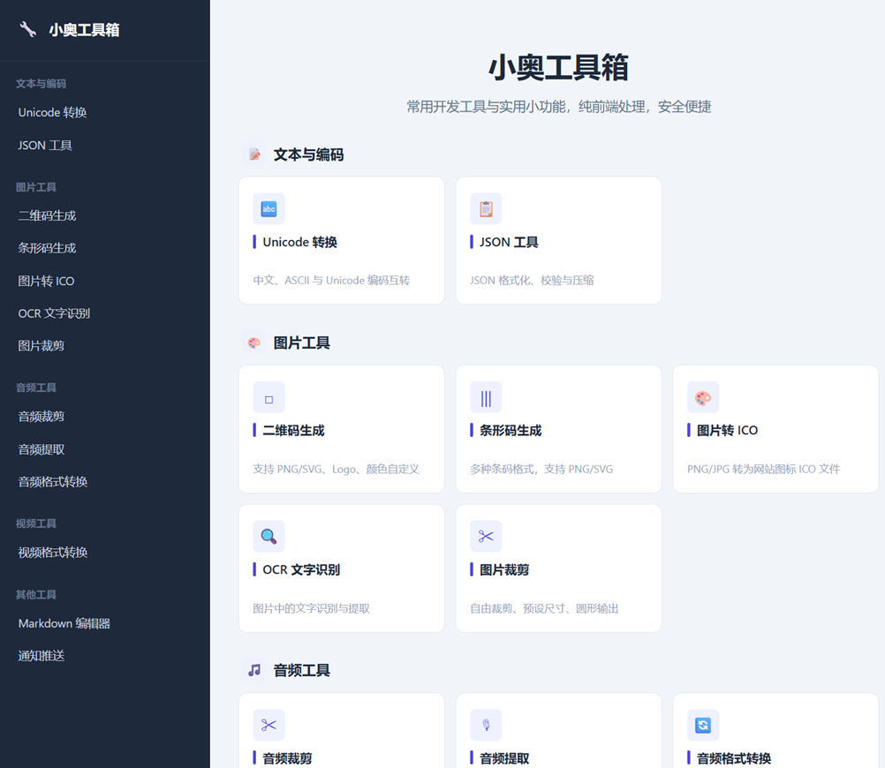

# 小奥工具箱：一个干净的在线工具集合，没有广告打扰

打开搜索引擎搜"在线 JSON 格式化""在线二维码生成""在线视频转 MP3"，跳出来的结果十有八九是铺天盖地的弹窗广告、悬浮推广、伪装成按钮的跳转链接,甚至还需要看 30 秒广告才能拿到处理结果。这些网站把"小工具"做成了"流量生意"，本该几秒搞定的事，往往要折腾好几分钟。

**[小奥工具箱](https://oddmeta.net/tools/ "小奥工具箱")**想做的事情很简单：把日常会用到的那些小工具集中到一起，**纯前端处理、不收集数据、不塞广告**，打开就能用，用完就能走。

项目地址：[https://github.com/oddmeta/oddtools](https://github.com/oddmeta/oddtools "小奥工具箱")

## 一、文本与编码

### Unicode 转换
中文、ASCII 与 Unicode 编码之间互转。写前端处理中文字符、调试编码问题、做国际化时偶尔会需要,这里一键搞定。

### JSON 工具
开发者每天都要打交道的格式化、校验、压缩三件套。粘贴进来,自动美化、错位提示,省下打开 IDE 的功夫。

## 二、图片工具

### 二维码生成
支持 PNG/SVG 输出,可以自定义颜色、嵌入 Logo。做活动海报、生成名片二维码、给文章配二维码都够用。

### 条形码生成
覆盖常见条码格式,同样支持 PNG/SVG。商品标签、库存管理的小场景用得上。

### 图片转 ICO
PNG/JPG 一键转 ICO。给网站做 favicon、给桌面应用做图标时不用再翻老软件。

### OCR 文字识别
上传图片直接提取文字,省去手动抄写。截图里的代码、扫描件里的段落、文档照片里的内容,都能识别。

### 图片裁剪
自由裁剪、预设比例、圆形输出,头像、封面、缩略图都能处理,不用再开 PS。

## 三、音频工具

### 音频裁剪
按时间截取片段,导出 WAV。做铃声、截副歌、剪播客片段都方便。

### 音频提取
从视频里把音轨抽出来。下载的讲座想只听声音、视频里的 BGM 想单独保存,用它就行。

### 音频格式转换
MP3/WAV/FLAC/AAC 互转。设备不支持的格式、上传平台限制的格式,转一下就好。

## 四、视频工具

### 视频格式转换
MP4/WEBM/MKV/AVI 互转。所有处理在浏览器内通过 FFmpeg WASM 完成,**视频不会上传到服务器**,隐私有保障。

## 五、其他工具

### Markdown 编辑器
在线写 Markdown,实时预览。临时写一份文档、整理一段笔记,不需要专门装编辑器。

### 通知推送
多渠道消息推送测试,调试 webhook、验证通知通道时用得上。

---

## 为什么用小奥工具箱?

- **没有广告**——不会有弹窗、跳转、伪装按钮,页面干净。
- **本地处理**——绝大多数工具纯前端运算,文件不上传,隐私不外泄。
- **打开即用**——无需注册、无需登录、无需下载客户端。
- **分类清晰**——按文本、图片、音视频分类,侧边栏直达。
- **永久免费**——所有功能完整开放,没有"高级版解锁"套路。

如果你也厌倦了那些"广告比工具还多"的在线工具站,不妨把小奥工具箱加进收藏夹。下次需要处理个二维码、转个音频、格式化个 JSON 的时候,直接拿来用就好。

> 工具箱地址:[https://oddmeta.net/tools/ "小奥工具箱"](https://oddmeta.net/tools/ "小奥工具箱") · 本地处理 · 隐私安全
> 项目地址：[https://github.com/oddmeta/oddtools](https://github.com/oddmeta/oddtools "小奥工具箱")